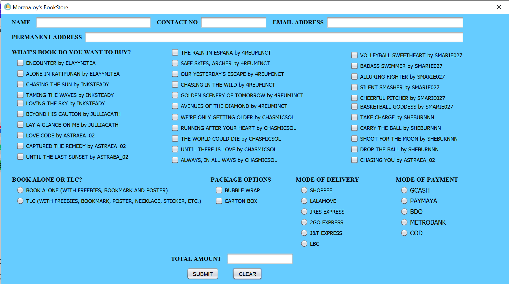
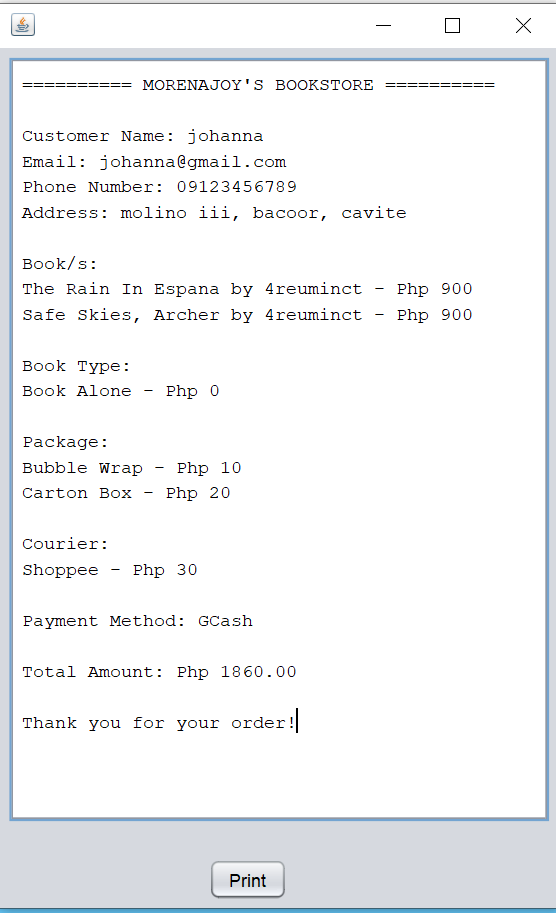

# Morenajoy-BookStore
A Java Swing-based bookstore ordering system with MySQL database integration and receipt generation.

## Live Demo
https://youtu.be/F1QjNEUPdU8

## Features
- Book selection system
- Courier and payment options
- Automatic total calculation
- MySQL database integration
- Receipt generation in separate window

---

## Screenshots

### Main Interface


### 🧾 Receipt Window


## Requirements

Before running the application, install:

- Java JDK 8 or higher
- XAMPP (for MySQL database)

---

## How to Run the Application

### Step 1: Download the Project
- Click the green `Code` button
- Select `Download ZIP`
- Extract the ZIP file

---

### Step 2: Start MySQL Database
1. Open XAMPP
2. Start `Apache`
3. Start `MySQL`

Open phpMyAdmin:
```text
http://localhost/phpmyadmin
```

Create database:
```sql
CREATE DATABASE bookstore;
```

Create table:
```sql
CREATE TABLE orders (
    id INT AUTO_INCREMENT PRIMARY KEY,
    name VARCHAR(100),
    email VARCHAR(100),
    phone VARCHAR(20),
    address TEXT,
    books TEXT,
    courier VARCHAR(50),
    payment VARCHAR(50),
    total DOUBLE
);
```

---

### Step 3: Run the JAR File

Go to the `dist` folder and double click:

```text
MorenajoyBookstore.jar
```

OR run using command prompt:

```bash
java -jar MorenajoyBookstore.jar
```

---

## Technologies Used
- Java
- Java Swing
- MySQL
- NetBeans IDE

---

## Author
Nicole Joy Hernandez
